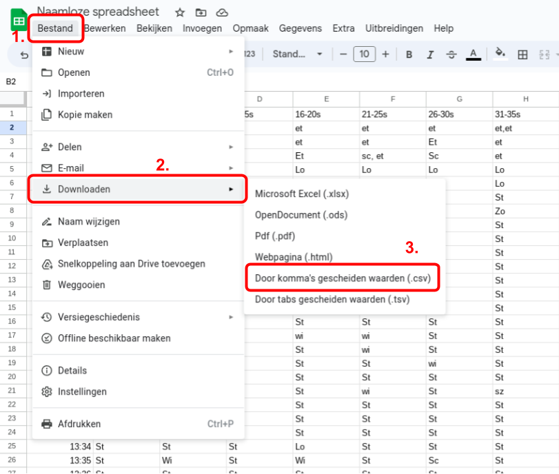
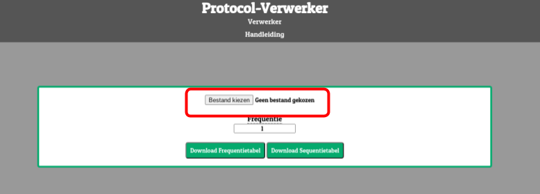

# Protocol-Verwerker

## Stap 1: Exporteren
Ga naar google spreadsheets, ga naar Bestand -> Downloaden -> Door komma's gescheiden waarden (.csv).

## Stap 2: Uploaden

Ga naar <a href="https://giellio.github.io/protocol-verwerker" target="_blank"
rel="noopener noreferrer">de
verwerker</a> en upload je csv bestand.

## Stap 3: Download je resultaten

Kies een frequentie in minuten die samen worden gecalculeerd, hierbij gaat het programma ervanuit dat
iedere regel een minuut is. 
Als je hem bijvoorbeeld instelt op 5, zal hij voor iedere 5 minuten tellen hoevaak ieder gedragselement
voorkomt. 
Dit heeft geen invloed op de sequentietabel of de ethogram.

Kies of je een visuele animatie wilt zien, die laat zien hoe de tabellen (Exclusief ethogram) samengesteld worden.

Druk vervolgens op de downloadknop van de tabel naar keuze.

## Stap 4: Importeer naar Google Spreadsheets

Ga naar Bestand -> Importeer en kies het bestand dat je zojuist gedownload hebt. 
Kies de importeer-instelling die voor jou werken. Bij twijfel, kies nieuwe bladen invoegen en laat de
rest op standaard staan.
